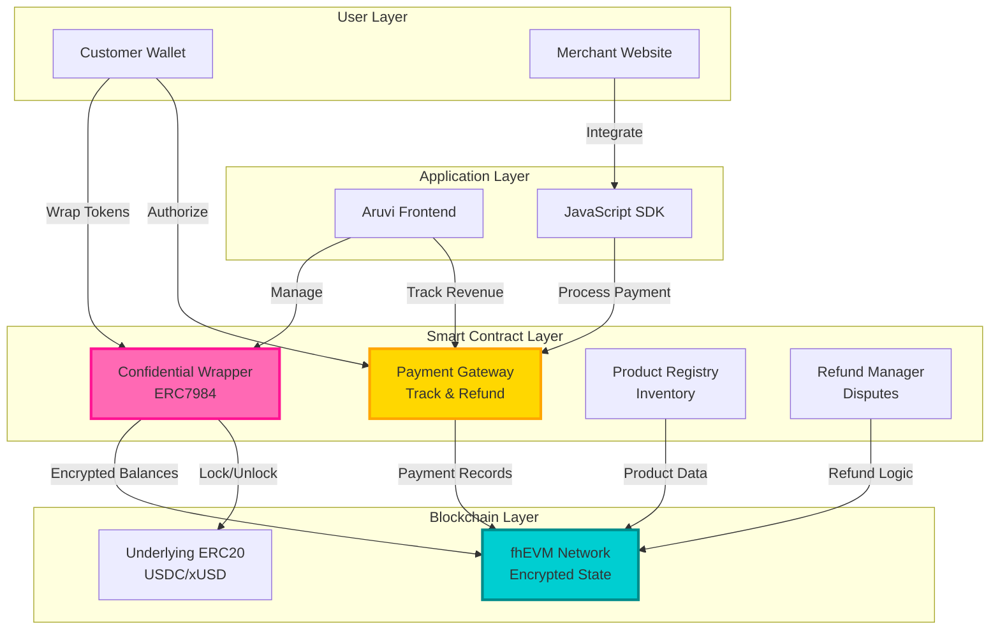
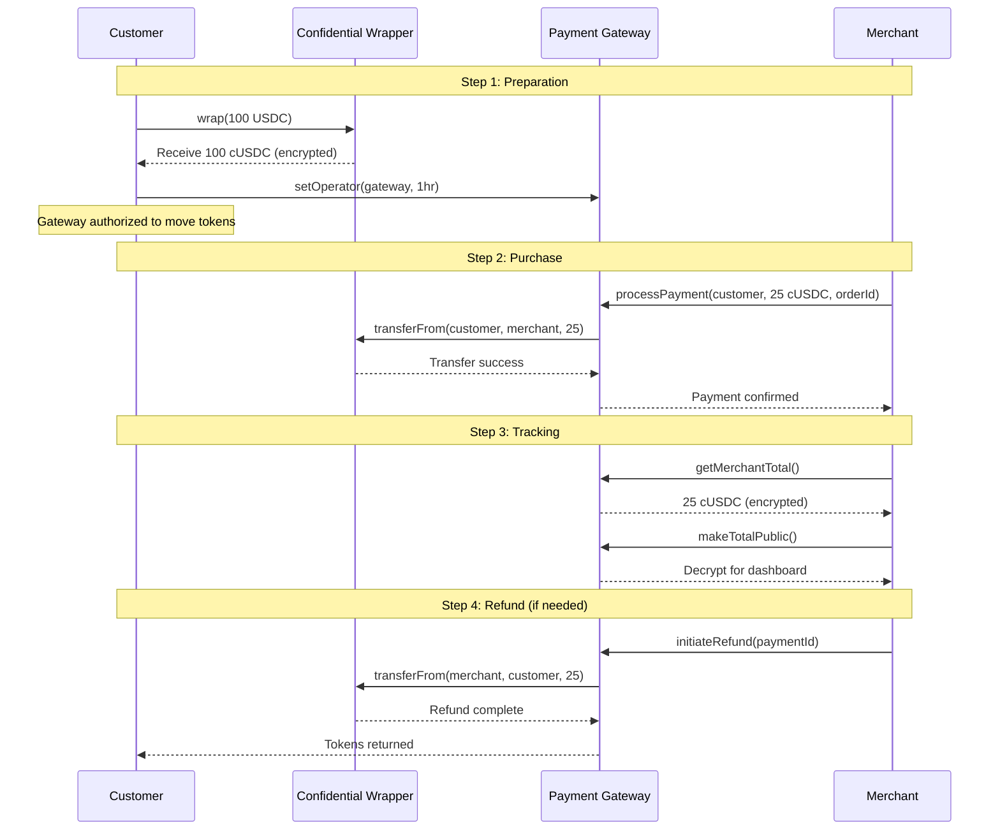
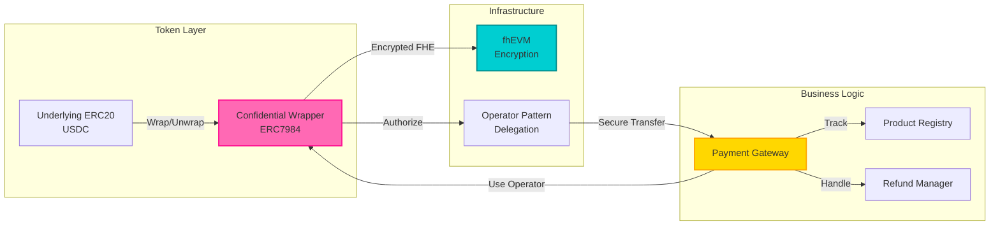

# Aruvi 🌊

**Privacy-first payment gateway for confidential transactions on Ethereum**

Aruvi combines the transparency of blockchain with the privacy of traditional payments. Built on fhEVM (Fully Homomorphic Encryption), it lets merchants accept payments without exposing customer balances or transaction amounts to the public.

Think Stripe, but private. Think crypto, but discreet.

---

## Why Aruvi?

Traditional crypto payments expose everything. Every transaction, every balance, every purchase is public forever. This isn't just uncomfortable—it's dangerous for businesses.

**The Problem:**
- Customer buys a coffee → entire wallet balance exposed
- Competitor sees your revenue in real-time
- Salaries, suppliers, everything is public
- No privacy = no adoption for real commerce

**Aruvi's Solution:**
- ✨ **Confidential tokens** - balances stay encrypted on-chain
- 🔐 **Private transactions** - amounts hidden, only participants know
- 🏪 **Merchant dashboard** - track revenue without exposing it publicly
- 💰 **Built-in refunds** - handle disputes like a real payment processor
- 📊 **Tax compliance** - selective disclosure for audits only
- 🎯 **Simple integration** - 3 lines of JavaScript, that's it

---

## Features

### For Customers
- **Wrap & Pay** - Convert USDC to confidential cUSDC in one click
- **Private Balances** - Nobody knows how much you have (not even explorers)
- **Direct Transfers** - Send tokens P2P without merchant overhead
- **Decrypt on Demand** - Choose when to reveal your balance
- **Multi-Token Support** - USDC and xUSD (testnet), extensible to any ERC20

### For Merchants
- **Payment Gateway** - Accept confidential payments with order tracking
- **Revenue Dashboard** - See your earnings (privately decrypted)
- **Refund System** - Handle returns and disputes on-chain
- **Product Registry** - Track inventory and link payments to products
- **Tax Portal** - Public audit mode for compliance without exposing everything
- **3-Line Integration** - JavaScript SDK, no backend needed

### For Developers
- **ERC7984 Standard** - Confidential ERC20 wrapper tokens
- **fhEVM Infrastructure** - Fully homomorphic encryption on Ethereum
- **Operator Pattern** - Safe delegation for gateway operations
- **TypeScript SDK** - Type-safe merchant integration
- **Hardhat Scripts** - One-command deployment
- **Open Source** - MIT license, hack away

---

## Architecture

### High-Level Overview



### Payment Flow



### Contract Architecture



---

## Quick Start

### For Users

1. **Connect Wallet** - Visit [app.aruvi.xyz](https://app.aruvi.xyz) (when deployed)
2. **Get Tokens** - Use Circle faucet for USDC or mint xUSD
3. **Wrap** - Convert to confidential cUSDC/cxUSD
4. **Authorize** - Give gateway permission (1 hour, revocable)
5. **Shop** - Pay on any Aruvi-integrated merchant site

### For Merchants

Add Aruvi to your website in 3 lines:

```html
<!-- 1. Include SDK -->
<script src="https://cdn.aruvi.xyz/sdk.js"></script>

<!-- 2. Initialize -->
<script>
  const aruvi = new AruviSDK({
    gatewayAddress: '0x...', // Sepolia testnet
    productRegistryAddress: '0x...'
  });
</script>

<!-- 3. Create payment button -->
<button onclick="aruvi.createPayment({ amount: '25.00', orderId: 'ORDER123' })">
  Pay with Aruvi
</button>
```

**Full documentation:** [docs.aruvi.xyz](https://docs.aruvi.xyz) (GitBook - coming soon)

---

## Developer Setup

### Prerequisites

- Node.js 18+
- Hardhat
- Wallet with Sepolia ETH
- fhEVM gateway access

### Clone & Install

```bash
git clone https://github.com/yourusername/aruvi.git
cd aruvi

# Install contract dependencies
cd contracts
npm install

# Install frontend dependencies
cd ../frontend
npm install
```

### Environment Setup

**contracts/.env** (copy from `.env.example`)
```bash
cp contracts/.env.example contracts/.env
# Edit with your private key and RPC URL
```

**frontend/.env.local** (copy from `.env.example`)
```bash
cp frontend/.env.example frontend/.env.local
# Update contract addresses after deployment
```

**Dual Token System:**

Aruvi supports both USDC and xUSD. Use the appropriate config:

```bash
# For USDC testing (Circle's official USDC)
cp frontend/.env.usdc frontend/.env.local

# For xUSD testing (custom mock token)
cp frontend/.env.xusd frontend/.env.local
```

Each `.env` file contains the deployed contract addresses for that token system.

### Deploy Contracts

```bash
cd contracts

# Deploy xUSD mock token first
npx hardhat run scripts/deploy-xusd.ts --network sepolia

# Deploy core contracts (wrapper + gateway + registry + refunds)
npx hardhat run deploy/deploy.ts --network sepolia

# Or use deploy scripts individually
npx hardhat run deploy/00_xusd.ts --network sepolia
npx hardhat run deploy/01_core.ts --network sepolia
```

### Run Frontend

```bash
cd frontend
npm run dev
```

Visit `http://localhost:3000`

### Run Tests

```bash
cd contracts
npx hardhat test
```

---

## Deployed Contracts (Sepolia Testnet)

### Token Wrappers
- **USDC Wrapper (cUSDC):** `0x...` (update after deployment)
- **xUSD Wrapper (cxUSD):** `0x...` (update after deployment)

### Business Logic
- **USDC Payment Gateway:** `0x...`
- **xUSD Payment Gateway:** `0x...`
- **Product Registry:** `0x...`
- **Refund Manager:** `0x...`

### Underlying Tokens
- **USDC (Circle):** `0x1c7D4B196Cb0C7B01d743Fbc6116a902379C7238`
- **xUSD (Mock):** `0x...`

---

## Merchant Integration Guide

### Step 1: Register as Merchant

```javascript
const aruvi = new AruviSDK({
  gatewayAddress: '0xYourGatewayAddress',
  productRegistryAddress: '0xYourProductRegistryAddress',
  tokenSystem: 'USDC' // or 'xUSD'
});

// Register once
await aruvi.registerMerchant();
```

### Step 2: Add Products (Optional)

```javascript
await aruvi.addProduct({
  name: 'Premium Coffee',
  price: 5.99,
  inventory: 100
});
```

### Step 3: Create Payment Button

```html
<div id="aruvi-checkout"></div>

<script>
  aruvi.createPayment({
    amount: '5.99',
    orderId: 'ORDER-' + Date.now(),
    productId: 0, // Optional
    onSuccess: (tx) => {
      console.log('Payment successful:', tx);
      // Fulfill order
    },
    onError: (err) => {
      console.error('Payment failed:', err);
    }
  });
</script>
```

### Step 4: Handle Refunds

```javascript
// In your admin panel
await aruvi.initiateRefund({
  paymentId: 'payment_123',
  reason: 'Customer request'
});
```

### Step 5: View Revenue

```javascript
// Get encrypted total
const total = await aruvi.getMerchantTotal();

// Decrypt for display (requires signature)
const decrypted = await aruvi.decryptTotal();
console.log(`Total revenue: ${decrypted} cUSDC`);
```

---

## Security Considerations

### Operator Authorization
- Gateway requires operator permission (1 hour default)
- Users must explicitly authorize via `setOperator(gateway, expiry)`
- Can be revoked anytime by setting expiry to 0
- Never share private keys or signatures

### Encryption
- Balances encrypted with fhEVM (fully homomorphic)
- Only key holders can decrypt (wallet owner + authorized parties)
- No plaintext amounts stored on-chain
- Gateway never sees unencrypted balances

### Smart Contract Audits
⚠️ **Not audited yet** - use at your own risk on testnet only. Mainnet deployment requires professional audit.

### Best Practices
- Always verify contract addresses before transactions
- Use hardware wallets for production
- Limit operator duration to minimum needed
- Regular balance checks with decrypt
- Monitor gateway authorization status

---

## Roadmap

**Q1 2025**
- ✅ ERC7984 confidential wrapper
- ✅ Payment gateway with refunds
- ✅ Basic merchant dashboard
- ✅ Multi-token support (USDC + xUSD)

**Q2 2025**
- 🔄 Production database (Supabase/Postgres)
- 🔄 Advanced merchant analytics
- 🔄 Subscription payment support
- 🔄 Mobile-responsive improvements

**Q3 2025**
- 📋 Professional smart contract audit
- 📋 Mainnet deployment
- 📋 Custom token wrapper factory
- 📋 Merchant API webhooks

**Q4 2025**
- 📋 Cross-chain bridge support
- 📋 Hardware wallet integration
- 📋 Enterprise merchant features
- 📋 Developer grants program

---

## Test Results

All critical FHE contract functionality has been thoroughly tested and validated:

```
✅ 94 passing tests (7s)
📋 7 pending (features not yet implemented)
❌ 0 failing
```

### Test Coverage

**ConfidentialUSDCWrapper (21 tests)**
- ✅ Deployment & configuration
- ✅ USDC wrapping (1:1 conversion)
- ✅ Balance decryption & verification
- ✅ Confidential P2P transfers
- ✅ Operator management & authorization
- ✅ Edge cases (zero amounts, multiple wraps)

**PaymentGateway (46 tests)**
- ✅ Merchant registration & management
- ✅ Payment processing with encrypted amounts
- ✅ Refund system (full & partial)
- ✅ Meta-transactions with EIP-712 signatures
- ✅ Nonce management & replay protection
- ✅ Encrypted revenue totals (lifetime & monthly)
- ✅ Public disclosure controls
- ✅ Payment history & queries
- ✅ Ownership & access control

**ProductRegistry (27 tests)**
- ✅ Product registration (public & encrypted pricing)
- ✅ Product updates (price, name, description)
- ✅ Product deactivation
- ✅ Product queries & filtering
- ✅ Multiple merchants support
- ✅ Product type differentiation (PRODUCT, SUBSCRIPTION, DONATION, P2P)
- ✅ Gateway integration
- ✅ Ownership management

**Integration Tests**
- ✅ End-to-end: USDC → cUSDC → Payment → Merchant receives
- ✅ Full refund flow: Payment → Refund → Customer receives back
- ✅ Multiple payments from wrapped balance
- ✅ Operator authorization & expiry
- ✅ RefundManager queue & processing

### Running Tests

```bash
cd contracts
npx hardhat test
```

For verbose output:
```bash
npx hardhat test --verbose
```

For gas reporting:
```bash
REPORT_GAS=true npx hardhat test
```

---

## Tech Stack

**Frontend**
- Next.js 16 (Turbopack)
- TypeScript
- RainbowKit + Wagmi
- TailwindCSS
- Framer Motion

**Contracts**
- Solidity 0.8.24

- Hardhat
- fhEVM (Zama)
- ERC7984 standard
- OpenZeppelin libraries

**Infrastructure**
- fhEVM network
- Sepolia testnet
- IPFS (future)
- GitBook (docs)

---

## Contributing

We welcome contributions! Here's how:

1. Fork the repo
2. Create feature branch (`git checkout -b feature/amazing`)
3. Commit changes (`git commit -m 'Add amazing feature'`)
4. Push to branch (`git push origin feature/amazing`)
5. Open Pull Request

**Guidelines:**
- Write tests for new features
- Follow existing code style
- Update documentation
- Keep commits atomic and clear

---

## Documentation

Full documentation available at **[docs.aruvi.xyz](https://docs.aruvi.xyz)** (GitBook)

Topics covered:
- Architecture deep-dive
- API reference
- SDK documentation
- Contract interfaces
- Integration examples
- Security best practices
- FAQ & troubleshooting

---

## License

MIT License - see [LICENSE](LICENSE) file

Free to use, modify, and distribute. Attribution appreciated but not required.

---

## Acknowledgments

Built with:
- [fhEVM by Zama](https://www.zama.ai/fhevm) - Fully homomorphic encryption
- [RainbowKit](https://www.rainbowkit.com/) - Beautiful wallet connection
- [Hardhat](https://hardhat.org/) - Ethereum development environment
- [Next.js](https://nextjs.org/) - React framework
- Circle USDC - Stablecoin infrastructure

---

## Links

- **Website:** [aruvi.xyz](https://aruvi.xyz) (coming soon)
- **Docs:** [docs.aruvi.xyz](https://docs.aruvi.xyz) (GitBook)
- **Twitter:** [@AruviPay](https://twitter.com/AruviPay) (update with actual)
- **Discord:** [Join Community](https://discord.gg/aruvi) (update with actual)

---

## Support

Need help?
- 📚 Check [documentation](https://docs.aruvi.xyz)
- 💬 Join [Discord](https://discord.gg/aruvi)
- 🐛 Open an [issue](https://github.com/yourusername/aruvi/issues)
- 📧 Email: support@aruvi.xyz (update with actual)

---

<div align="center">

**Made with 💜 by [Ram](https://github.com/yourprofile)**

*Privacy is a right, not a privilege*

</div>
