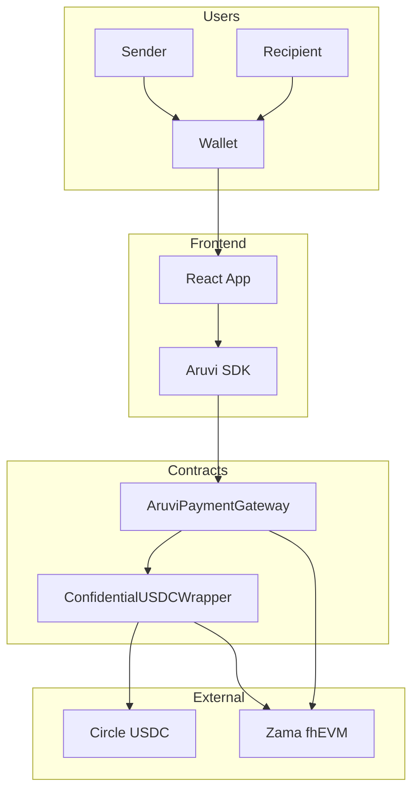
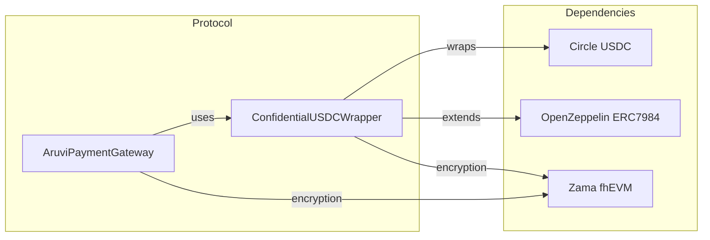

<p align="center">
  
</p>

<h1 align="center">Aruvi</h1>

<p align="center">
  <strong>Privacy-First Payments on Ethereum</strong><br>
  <em>அருவி (Aruvi) — Tamil for "waterfall" — where privacy flows freely</em>
</p>

<p align="center">
  <a href="https://aruvi-dapp.vercel.app">🚀 Live App</a> •
  <a href="https://aruvi-documentation.vercel.app">📚 Documentation</a> •
  <a href="https://www.npmjs.com/package/@aruvi/sdk">📦 npm</a>
</p>

<p align="center">
  <a href="#features">Features</a> •
  <a href="#architecture">Architecture</a> •
  <a href="#quick-start">Quick Start</a> •
  <a href="#sdk-integration">SDK Integration</a> •
  <a href="#test-results">Test Results</a>
</p>

---

## Live Deployments

| Platform | URL |
|----------|-----|
| 🚀 **App** | [aruvi-dapp.vercel.app](https://aruvi-dapp.vercel.app) |
| 📚 **Docs** | [aruvi-documentation.vercel.app](https://aruvi-documentation.vercel.app) |
| 📦 **SDK** | [npmjs.com/package/@aruvi/sdk](https://www.npmjs.com/package/@aruvi/sdk) |

---

## Overview

Aruvi is a privacy-first payment protocol built on [Zama's fhEVM](https://www.zama.ai/fhevm) (Fully Homomorphic Encryption Virtual Machine). It enables confidential USDC transfers where **transaction amounts are encrypted on-chain** — only the sender and recipient can decrypt them.

Unlike traditional blockchain payments where anyone can view your transaction history, Aruvi ensures your financial data stays private while maintaining the security guarantees of Ethereum.

### Why Aruvi?

| Traditional Payments | Blockchain Payments | Aruvi |
|---------------------|---------------------|-------|
| ✅ Amount private | ❌ Amount public | ✅ Amount encrypted |
| ❌ Centralized | ✅ Decentralized | ✅ Decentralized |
| ❌ Slow settlement | ✅ Fast settlement | ✅ Fast settlement |
| ❌ High fees | ⚠️ Variable fees | ⚠️ Variable fees |
| ❌ Censorship risk | ✅ Censorship resistant | ✅ Censorship resistant |

---

## Features

### 🔐 Privacy-First Architecture
- Transaction amounts encrypted using Fully Homomorphic Encryption (FHE)
- Only sender and recipient can decrypt payment details
- On-chain computation on encrypted data without decryption

### 💸 Core Payment Features
- **Send** — P2P encrypted payments
- **Request** — Request money with shareable links/QR codes  
- **Multi-Send** — Batch payments to up to 10 recipients
- **Subscriptions** — Recurring payments with encrypted amounts
- **Refunds** — Recipients can refund payments

### 🪙 USDC Integration
- Wraps Circle's official USDC into confidential cUSDC
- 1:1 conversion rate (1 USDC = 1 cUSDC)
- Unwrap back to standard USDC anytime

### 🛠️ Developer SDK
- JavaScript/TypeScript SDK for business integration
- React components for checkout flows
- Server-side payment verification utilities

---

## Testnet Deployment

| Contract | Address | Network |
|----------|---------|---------|
| AruviPaymentGateway | `0x05798f2304A5B9263243C8002c87D4f59546958D` | Sepolia |
| ConfidentialUSDCWrapper | `0xf99376BE228E8212C3C9b8B746683C96C1517e8B` | Sepolia |
| USDC (Circle) | `0x1c7D4B196Cb0C7B01d743Fbc6116a902379C7238` | Sepolia |

---

## Architecture

### High-Level Overview



### Payment Flow

```mermaid
sequenceDiagram
    participant S as Sender
    participant W as Wallet
    participant G as Gateway
    participant T as cUSDC Token
    participant F as fhEVM
    
    Note over S,F: Wrapping Phase
    S->>W: Approve USDC spend
    S->>T: wrap amount
    T->>F: Create encrypted balance
    
    Note over S,F: Payment Phase
    S->>F: Encrypt amount locally
    S->>W: Sign transaction
    W->>G: send to recipient
    G->>F: Verify encryption proof
    G->>T: confidentialTransferFrom
    T->>F: Subtract from sender
    T->>F: Add to recipient
    G-->>S: PaymentSent event
```



### Contract Architecture



---

## Quick Start

### Prerequisites

- Node.js 18+
- MetaMask or compatible wallet
- Sepolia ETH (for gas)
- Sepolia USDC (for testing)

### Installation

```bash
# Clone repository
git clone https://github.com/ramakrishnanhulk20/Aruvi.git
cd Aruvi

# Install contract dependencies
cd contracts && npm install

# Install frontend dependencies
cd ../frontend && npm install

# Install SDK dependencies
cd ../sdk && npm install
```

### Development

```bash
# Compile contracts
cd contracts
npx hardhat compile

# Run tests
npx hardhat test

# Start frontend
cd ../frontend
npm run dev
```

---

## SDK Integration

Install the SDK to accept Aruvi payments on your website:

```bash
npm install @aruvi/sdk
```

### React Example

```tsx
import { AruviProvider, AruviButton } from '@aruvi/sdk/react';
import '@aruvi/sdk/styles.css';

function App() {
  return (
    <AruviProvider
      config={{
        merchantAddress: '0xYourWalletAddress',
        environment: 'testnet',
      }}
    >
      <AruviButton
        payment={{
          amount: '25.00',
          description: 'Premium Plan',
        }}
        onSuccess={(result) => {
          console.log('Payment ID:', result.paymentId);
        }}
      />
    </AruviProvider>
  );
}
```

### Vanilla JavaScript

```html
<script src="https://cdn.jsdelivr.net/npm/@aruvi/sdk@latest/dist/aruvi-sdk.min.js"></script>
<script>
  Aruvi.init({
    merchantAddress: '0xYourWalletAddress',
    environment: 'testnet',
  });

  Aruvi.button('#pay-button', {
    amount: '25.00',
    description: 'Premium Plan',
    onSuccess: (result) => console.log('Paid!', result.paymentId),
  });
</script>
```

📖 **Full SDK documentation**: [aruvi-documentation.vercel.app](https://aruvi-documentation.vercel.app)

---

## Smart Contracts

### AruviPaymentGateway

Main payment processor handling all P2P transactions.

| Function | Description |
|----------|-------------|
| `send(recipient, encAmount, proof)` | Send encrypted payment |
| `multiSend(recipients[], amounts[], proofs[])` | Batch send (max 10) |
| `createRequest(encAmount, proof, expiry)` | Create payment request |
| `fulfillRequest(requestId, encAmount, proof)` | Pay a request |
| `createSubscription(recipient, encAmount, proof, interval)` | Setup recurring payment |
| `executeSubscription(subscriptionId)` | Execute due payment |
| `refund(paymentId)` | Refund payment (recipient only) |

### ConfidentialUSDCWrapper

Wraps standard ERC-20 USDC into confidential ERC-7984 tokens.

| Function | Description |
|----------|-------------|
| `wrap(to, amount)` | Convert USDC → cUSDC |
| `unwrap(from, to, amount)` | Convert cUSDC → USDC |
| `confidentialTransfer(to, encAmount, proof)` | Transfer encrypted tokens |
| `confidentialBalanceOf(account)` | Get encrypted balance handle |

---

## Test Results

```
  Aruvi Protocol
    ConfidentialUSDCWrapper
      Deployment
        ✔ should have correct name
        ✔ should have correct symbol
        ✔ should have correct underlying token
        ✔ should have 6 decimals matching USDC
        ✔ should have 1:1 conversion rate
      Wrapping USDC → cUSDC
        ✔ should wrap USDC into cUSDC
        ✔ should create encrypted balance after wrap
        ✔ should decrypt to correct wrapped amount (92ms)
        ✔ should allow wrapping to different recipient (76ms)
        ✔ should revert on insufficient allowance
      Confidential Transfers
        ✔ should transfer encrypted tokens between users (158ms)
    AruviPaymentGateway
      Deployment
        ✔ should set correct owner
        ✔ should set correct default token
      Send Payment
        ✔ should send encrypted payment (48ms)
        ✔ should update payment count
        ✔ should revert when sending to self
        ✔ should revert when sending to zero address
      Multi-Send
        ✔ should send to multiple recipients (110ms)
        ✔ should revert with more than 10 recipients (147ms)
      Payment Requests
        ✔ should create payment request
        ✔ should fulfill payment request (58ms)
        ✔ should cancel payment request
      Subscriptions
        ✔ should create subscription
        ✔ should execute subscription payment (40ms)
        ✔ should cancel subscription
        ✔ should revert subscription with interval less than 1 day
      Refunds
        ✔ should allow recipient to refund
        ✔ should mark payment as refunded
        ✔ should revert double refund
        ✔ should revert refund by non-recipient
      View Functions
        ✔ should return payment info (41ms)
        ✔ should return subscription info
      Admin Functions
        ✔ should allow owner to change default token
        ✔ should revert non-owner token change
        ✔ should transfer ownership
        ✔ should revert ownership transfer to zero address

  36 passing (4s)
```

---

## Project Structure

```
Aruvi/
├── contracts/              # Solidity smart contracts
│   ├── contracts/
│   │   ├── AruviPaymentGateway.sol
│   │   └── ConfidentialUSDCWrapper.sol
│   └── test/Aruvi.test.ts
│
├── frontend/               # React web application
│   └── src/
│       ├── components/
│       ├── hooks/
│       └── pages/
│
├── sdk/                    # @aruvi/sdk npm package
│   └── src/
│       ├── index.ts
│       └── react.tsx
│
└── docs/                   # Documentation (Docusaurus)
    └── docs/
```

---

## Tech Stack

| Layer | Technology |
|-------|------------|
| Smart Contracts | Solidity 0.8.27, Hardhat |
| FHE | Zama fhEVM, OpenZeppelin ERC-7984 |
| Frontend | React 18, TypeScript, Vite |
| Wallet | wagmi v2, viem, RainbowKit |
| SDK | TypeScript, Rollup |
| Docs | Docusaurus 3 |

---

## License

BSD-3-Clause License — see [LICENSE](LICENSE) for details.

---

## Acknowledgments

- [Zama](https://www.zama.ai/) — fhEVM and FHE infrastructure
- [Circle](https://www.circle.com/) — USDC stablecoin
- [OpenZeppelin](https://www.openzeppelin.com/) — ERC-7984 confidential token standard

---

<p align="center">
  Built with 🔐 by <a href="https://github.com/ramakrishnanhulk20">Ram</a>
</p>
