# Aruvi 🌊

> **Confidential Payments on Ethereum** — Accept crypto without exposing customer balances or transaction amounts.

Aruvi is a privacy-preserving payment gateway built on [ZAMA fhEVM](https://www.zama.ai/fhevm). It wraps standard ERC20 tokens (like USDC) into confidential tokens where all balances and transfer amounts are encrypted on-chain using Fully Homomorphic Encryption.

**No more public balances. No more exposed transaction amounts. Just private payments.**

---

## 🎯 What Problem Does Aruvi Solve?

On Ethereum, every transaction is public forever:
- Customer buys coffee → **entire wallet balance visible to the world**
- Competitor sees your revenue in real-time
- Salary payments expose your entire payroll

**Aruvi fixes this.** Balances stay encrypted. Amounts stay private. Only you decide who sees what.

---

## 📦 Deployed Contracts (Sepolia Testnet)

### USDC System (Circle's Official USDC)
Use for production-like testing with real USDC from [Circle Faucet](https://faucet.circle.com/)

| Contract | Address | Etherscan |
|----------|---------|-----------|
| **Underlying USDC** | `0x1c7D4B196Cb0C7B01d743Fbc6116a902379C7238` | [View](https://sepolia.etherscan.io/address/0x1c7D4B196Cb0C7B01d743Fbc6116a902379C7238) |
| **Confidential Wrapper (cUSDC)** | `0x5f8D47C188478fDf89a9aff7275b86553fc126fe` | [View](https://sepolia.etherscan.io/address/0x5f8D47C188478fDf89a9aff7275b86553fc126fe) |
| **Payment Gateway** | `0x5B263646881afd742c157D8Efc307ac39E65662e` | [View](https://sepolia.etherscan.io/address/0x5B263646881afd742c157D8Efc307ac39E65662e) |
| **Product Registry** | `0x0AA169680b5AAe296Fc8634C28B2a86ddb99f300` | [View](https://sepolia.etherscan.io/address/0x0AA169680b5AAe296Fc8634C28B2a86ddb99f300) |
| **Refund Manager** | `0xe2045ff92802F273506Be69b314b29ED9f0dF63e` | [View](https://sepolia.etherscan.io/address/0xe2045ff92802F273506Be69b314b29ED9f0dF63e) |

### xUSD System (Test Token with Faucet)
Use for quick testing — mint unlimited tokens directly in the app

| Contract | Address | Etherscan |
|----------|---------|-----------|
| **Underlying xUSD (MockUSDC)** | `0xC392ceE2b731A6a719BAd5205B9Cb44F346F012a` | [View](https://sepolia.etherscan.io/address/0xC392ceE2b731A6a719BAd5205B9Cb44F346F012a) |
| **Confidential Wrapper (cxUSD)** | `0xbA89Abc56387D3bA5864E6A0a0a5e7cd9d872845` | [View](https://sepolia.etherscan.io/address/0xbA89Abc56387D3bA5864E6A0a0a5e7cd9d872845) |
| **Payment Gateway** | `0xEcC6317E60C3115A782D577d02322eDc3c27119a` | [View](https://sepolia.etherscan.io/address/0xEcC6317E60C3115A782D577d02322eDc3c27119a) |
| **Product Registry** | `0x9523Bb7B1f1e3E773fc575Bc86f9b874C70B4D1D` | [View](https://sepolia.etherscan.io/address/0x9523Bb7B1f1e3E773fc575Bc86f9b874C70B4D1D) |
| **Refund Manager** | `0xe637B2B335F6Ab8A108d8d1Bc39916589703dC4E` | [View](https://sepolia.etherscan.io/address/0xe637B2B335F6Ab8A108d8d1Bc39916589703dC4E) |

---

## 🚀 Quick Start

### Run Locally (2 minutes)

```bash
git clone https://github.com/ramakrishnanhulk20/Aruvi
cd Aruvi/frontend
npm install

# Choose your token system:
cp .env.usdc .env.local    # For USDC (get from Circle faucet)
# OR
cp .env.xusd .env.local    # For xUSD (mint in app)

npm run dev
```

Open http://localhost:3000

### Get Test Tokens

**For USDC:**
1. Go to [Circle Faucet](https://faucet.circle.com/)
2. Get Sepolia USDC
3. Wrap to cUSDC in the app

**For xUSD:**
1. Go to `/tokens` page in the app
2. Click "Mint xUSD"
3. Wrap to cxUSD

---

## 💡 How It Works

### The Payment Flow

#### Customer Journey

```mermaid
flowchart LR
    subgraph WRAP ["1️⃣ WRAP"]
        A1[USDC] -->|1:1| A2[cUSDC]
        A3[Balance now ENCRYPTED]
    end
    
    subgraph AUTH ["2️⃣ AUTHORIZE"]
        B1[Grant gateway<br/>operator rights]
        B2[1 hour limit]
    end
    
    subgraph PAY ["3️⃣ PAY"]
        C1[Pay merchant]
        C2[Amount hidden<br/>on-chain]
    end
    
    subgraph DONE ["4️⃣ DONE"]
        D1[Receipt generated]
        D2[✅ Complete]
    end
    
    WRAP --> AUTH --> PAY --> DONE
    
    style WRAP fill:#e1f5fe
    style AUTH fill:#fff3e0
    style PAY fill:#f3e5f5
    style DONE fill:#e8f5e9
```


#### Merchant Journey

```mermaid
flowchart LR
    subgraph REG ["1️⃣ REGISTER"]
        A1[Sign up as merchant]
        A2[One-time setup]
    end
    
    subgraph PROD ["2️⃣ ADD PRODUCTS"]
        B1[Create catalog]
        B2[Set prices]
    end
    
    subgraph RECV ["3️⃣ RECEIVE"]
        C1[Get paid in<br/>encrypted tokens]
        C2[Revenue stays private]
    end
    
    subgraph DEC ["4️⃣ DECRYPT"]
        D1[View actual revenue]
        D2[For taxes & reports]
    end
    
    REG --> PROD --> RECV --> DEC
    
    style REG fill:#e1f5fe
    style PROD fill:#fff3e0
    style RECV fill:#f3e5f5
    style DEC fill:#e8f5e9
```


#### Detailed Payment Sequence

```mermaid
sequenceDiagram
    participant C as 👤 Customer
    participant W as 🔐 Wrapper
    participant G as 💳 Gateway
    participant M as 🏪 Merchant
    
    Note over C,M: Step 1: Preparation
    C->>W: wrap(100 USDC)
    W-->>C: ✅ Receive 100 cUSDC (encrypted)
    C->>W: setOperator(gateway, 1hr)
    Note over C: Gateway authorized
    
    Note over C,M: Step 2: Payment
    C->>G: pay(merchant, amount, orderId)
    G->>W: transferFrom(customer → merchant)
    W-->>G: ✅ Transfer success
    G-->>M: 📧 Payment notification
    
    Note over C,M: Step 3: Verification
    M->>G: getPaymentStatus(orderId)
    G-->>M: ✅ Confirmed (encrypted amount)
    
    Note over C,M: Step 4: Revenue Check
    M->>G: getMerchantTotal()
    G-->>M: 🔐 Encrypted total
    M->>G: decryptTotal(signature)
    G-->>M: 💰 Actual revenue revealed
```


### What's Encrypted?

| Data | On-Chain Visibility |
|------|---------------------|
| Customer balance | 🔐 Encrypted (only owner can decrypt) |
| Transfer amount | 🔐 Encrypted (only sender/receiver know) |
| Merchant revenue | 🔐 Encrypted (merchant decrypts privately) |
| Transaction exists | ✅ Public (tx hash visible) |
| Sender/Receiver | ✅ Public (addresses visible) |

---

## 🏗️ Architecture

### System Overview


### Contract Interactions


### Smart Contracts

```
contracts/
├── ConfidentialUSDCWrapper.sol   # ERC7984 - wraps ERC20 → encrypted token
├── PaymentGateway.sol            # Processes payments, tracks orders
├── ProductRegistry.sol           # Product catalog with encrypted prices
├── RefundManager.sol             # Handles refund queue
└── MockUSDC.sol                  # Test token (xUSD) with faucet
```

### Frontend

```
frontend/
├── app/
│   ├── checkout/        # Customer payment flow
│   ├── dashboard/       # Merchant revenue & management
│   ├── tokens/          # Wrap/unwrap & mint test tokens
│   └── api/             # Backend endpoints
├── hooks/
│   ├── useFhevm.tsx           # ZAMA FHE SDK integration
│   ├── usePaymentGateway.ts   # Gateway contract interactions
│   ├── useConfidentialToken.ts # Wrapper contract interactions
│   └── useRefundManager.ts    # Refund handling
└── lib/
    └── contracts.ts     # ABIs & addresses
```

### Tech Stack

| Layer | Technology |
|-------|------------|
| Frontend | Next.js 16, TypeScript, Tailwind CSS |
| Wallet | RainbowKit, Wagmi v2, Ethers.js v6 |
| Smart Contracts | Solidity 0.8.24, Hardhat |
| FHE | ZAMA fhEVM, Relayer SDK v0.3.0 |
| Network | Ethereum Sepolia Testnet |

---

## 🧪 Test Results

```
  ConfidentialUSDCWrapper
    ✔ wraps USDC to confidential tokens (1:1)
    ✔ unwraps confidential tokens back to USDC
    ✔ transfers encrypted amounts P2P
    ✔ operator can transfer on behalf of user
    ✔ decrypts balance with valid signature

  PaymentGateway
    ✔ registers new merchant
    ✔ processes payment with encrypted amount
    ✔ tracks payment history per merchant
    ✔ calculates encrypted revenue totals
    ✔ initiates and processes refunds
    ✔ validates EIP-712 meta-transactions
    ✔ prevents replay attacks via nonce

  ProductRegistry
    ✔ registers products with prices
    ✔ updates inventory on purchase
    ✔ queries products by merchant

  Integration
    ✔ end-to-end: wrap → authorize → pay → merchant receives
    ✔ full refund: payment → refund → customer restored

  94 passing (7s)
```

Run tests yourself:
```bash
cd contracts
npm install
npx hardhat test
```

---

## ⚙️ Environment Setup

### Required Variables

Create `frontend/.env.local`:

```bash
# Network
NEXT_PUBLIC_CHAIN_ID=11155111
NEXT_PUBLIC_SEPOLIA_RPC=https://sepolia.infura.io/v3/YOUR_KEY

# Choose ONE token system:

# === USDC System ===
NEXT_PUBLIC_WRAPPER_ADDRESS=0x5f8D47C188478fDf89a9aff7275b86553fc126fe
NEXT_PUBLIC_GATEWAY_ADDRESS=0x5B263646881afd742c157D8Efc307ac39E65662e
NEXT_PUBLIC_PRODUCT_REGISTRY_ADDRESS=0x0AA169680b5AAe296Fc8634C28B2a86ddb99f300
NEXT_PUBLIC_REFUND_MANAGER_ADDRESS=0xe2045ff92802F273506Be69b314b29ED9f0dF63e
NEXT_PUBLIC_UNDERLYING_ERC20=0x1c7D4B196Cb0C7B01d743Fbc6116a902379C7238

# === OR xUSD System ===
# NEXT_PUBLIC_WRAPPER_ADDRESS=0xbA89Abc56387D3bA5864E6A0a0a5e7cd9d872845
# NEXT_PUBLIC_GATEWAY_ADDRESS=0xEcC6317E60C3115A782D577d02322eDc3c27119a
# NEXT_PUBLIC_PRODUCT_REGISTRY_ADDRESS=0x9523Bb7B1f1e3E773fc575Bc86f9b874C70B4D1D
# NEXT_PUBLIC_REFUND_MANAGER_ADDRESS=0xe637B2B335F6Ab8A108d8d1Bc39916589703dC4E
# NEXT_PUBLIC_UNDERLYING_ERC20=0xC392ceE2b731A6a719BAd5205B9Cb44F346F012a

# Zama Relayer
NEXT_PUBLIC_RELAYER_URL=https://relayer.testnet.zama.org

# WalletConnect (get from cloud.walletconnect.com)
NEXT_PUBLIC_WALLETCONNECT_PROJECT_ID=your_project_id

# JWT Auth (generate a random 32+ char string)
JWT_SECRET=your-super-secret-key-at-least-32-characters
```

**Quick setup:** Just copy `.env.usdc` or `.env.xusd` to `.env.local`

---

## 🔐 Security

### Current Status
- ⚠️ **Testnet only** — Not audited
- ✅ Comprehensive test coverage (94 tests)
- ✅ Reentrancy protection
- ✅ Access control on all admin functions
- ✅ Time-limited operator permissions

### How Privacy Works

1. **FHE Encryption** — All balances stored as `euint64` encrypted integers
2. **Operator Pattern** — Gateway gets time-limited (1 hour) permission to transfer
3. **Selective Disclosure** — Only account owner can decrypt their balance
4. **On-Chain Verification** — ZAMA oracle verifies decryption signatures

### Before Mainnet
- [ ] Professional smart contract audit
- [ ] Formal verification of FHE operations
- [ ] Bug bounty program

---

## 📖 User Guide

### For Customers

1. **Connect Wallet** — MetaMask, Rainbow, or any WalletConnect wallet
2. **Get Tokens** — USDC from Circle faucet or mint xUSD in app
3. **Wrap Tokens** — Convert to confidential version (1:1)
4. **Authorize Gateway** — Allow payment processing (auto-expires in 1 hour)
5. **Make Payment** — Amount stays encrypted on-chain

### For Merchants

1. **Register** — Go to `/register` and sign up
2. **Add Products** — Create catalog at `/dashboard/products`
3. **Receive Payments** — Customers pay, you see encrypted total
4. **Decrypt Revenue** — Sign to view your actual earnings
5. **Process Refunds** — Handle disputes from dashboard

---

## � Merchant Integration Guide

Want to accept Aruvi payments on your website? Here's how:

### Option 1: Redirect to Aruvi Checkout

Simplest integration — redirect customers to Aruvi's hosted checkout page:

```html
<a href="https://your-aruvi-instance.com/checkout?merchant=YOUR_ADDRESS&amount=1000000&orderId=ORDER123">
  Pay with Aruvi
</a>
```

Query parameters:
- `merchant` — Your wallet address (registered as merchant)
- `amount` — Amount in token's smallest unit (1000000 = 1 USDC with 6 decimals)
- `orderId` — Your unique order reference

### Option 2: Direct Contract Integration

For full control, interact with the PaymentGateway contract directly:

#### 1. Install Dependencies

```bash
npm install ethers wagmi
```

#### 2. Initialize Contract

```typescript
import { ethers } from 'ethers';

// USDC System (Sepolia)
const GATEWAY_ADDRESS = '0x5B263646881afd742c157D8Efc307ac39E65662e';
const WRAPPER_ADDRESS = '0x5f8D47C188478fDf89a9aff7275b86553fc126fe';

// Gateway ABI (minimal)
const GATEWAY_ABI = [
  'function processPayment(address customer, bytes32 orderId, bytes calldata encryptedAmount) external',
  'function getPayment(bytes32 orderId) external view returns (tuple(address customer, address merchant, uint256 timestamp, bool refunded))',
  'function registerMerchant() external',
  'event PaymentProcessed(bytes32 indexed orderId, address indexed customer, address indexed merchant)'
];

const gateway = new ethers.Contract(GATEWAY_ADDRESS, GATEWAY_ABI, provider);
```

#### 3. Register as Merchant (One-time)

```typescript
// Connect with merchant's wallet
const signer = await provider.getSigner();
const gatewayWithSigner = gateway.connect(signer);

// Register (only needed once)
const tx = await gatewayWithSigner.registerMerchant();
await tx.wait();
console.log('Merchant registered!');
```

#### 4. Customer Payment Flow

```typescript
// Customer must first:
// 1. Wrap USDC → cUSDC via Wrapper contract
// 2. Call setOperator(GATEWAY_ADDRESS, expiryTimestamp) on Wrapper

// Then process payment:
const orderId = ethers.encodeBytes32String('ORDER-' + Date.now());
const encryptedAmount = customerEncryptedInput; // From ZAMA FHE SDK

const tx = await gatewayWithSigner.processPayment(
  customerAddress,
  orderId,
  encryptedAmount
);
await tx.wait();
```

#### 5. Verify Payment

```typescript
// Check payment status
const payment = await gateway.getPayment(orderId);

if (payment.timestamp > 0 && !payment.refunded) {
  console.log('Payment confirmed!');
  // Fulfill order...
}
```

#### 6. Listen for Payment Events

```typescript
gateway.on('PaymentProcessed', (orderId, customer, merchant) => {
  console.log(`Payment received: ${orderId}`);
  // Webhook to your backend, fulfill order, etc.
});
```

### Option 3: Use Aruvi API Routes

Call Aruvi's API endpoints from your backend:

```typescript
// Create payment session
const response = await fetch('https://your-aruvi-instance.com/api/payment/session', {
  method: 'POST',
  headers: { 'Content-Type': 'application/json' },
  body: JSON.stringify({
    merchant: 'YOUR_WALLET_ADDRESS',
    amount: '1000000',
    orderId: 'ORDER123',
    returnUrl: 'https://yoursite.com/success'
  })
});

const { sessionId, checkoutUrl } = await response.json();
// Redirect customer to checkoutUrl
```

```typescript
// Verify payment
const verify = await fetch('https://your-aruvi-instance.com/api/payment/verify', {
  method: 'POST',
  headers: { 'Content-Type': 'application/json' },
  body: JSON.stringify({ orderId: 'ORDER123' })
});

const { verified, txHash } = await verify.json();
```

### Contract ABIs

Full ABIs available at:
- `frontend/lib/abi/PaymentGateway.json`
- `frontend/lib/abi/ConfidentialUSDCWrapper.json`
- `frontend/lib/abi/ProductRegistry.json`
- `frontend/lib/abi/RefundManager.json`

### Integration Checklist

- [ ] Register your wallet as merchant on PaymentGateway
- [ ] Store customer's orderId for tracking
- [ ] Listen for `PaymentProcessed` events OR poll `getPayment()`
- [ ] Handle refund requests via RefundManager
- [ ] Test with xUSD system first (free mint)
- [ ] Switch to USDC system for production

---

## �🛠️ Development

### Deploy Your Own Contracts

```bash
cd contracts
npm install
cp .env.example .env
# Add your private key and RPC URL

# Deploy xUSD system (mock token + all contracts)
npx hardhat run scripts/deploy-xusd.ts --network sepolia

# Or deploy individual contracts
npx hardhat run deploy/00_xusd.ts --network sepolia
npx hardhat run deploy/01_core.ts --network sepolia
```

### Build for Production

```bash
cd frontend
npm run build
```

### Project Structure

```
Aruvi/
├── contracts/           # Solidity smart contracts
│   ├── contracts/       # Source files
│   ├── deploy/          # Deployment scripts
│   ├── scripts/         # Utility scripts
│   └── test/            # Test files
├── frontend/            # Next.js application
│   ├── app/             # Pages (App Router)
│   ├── components/      # React components
│   ├── hooks/           # Custom React hooks
│   ├── lib/             # Utilities & ABIs
│   └── providers/       # Context providers
└── docs/                # Documentation
    ├── checkout-sequence.md
    ├── frontend-flow-plan.md
    └── public decryption.md
```

---

## 🤝 Contributing

1. Fork the repo
2. Create feature branch: `git checkout -b feature/amazing`
3. Commit: `git commit -m 'Add amazing feature'`
4. Push: `git push origin feature/amazing`
5. Open Pull Request

---

## 📄 License

MIT License — Free to use, modify, and distribute.

---

## 🔗 Links

- **GitHub:** [github.com/ramakrishnanhulk20/Aruvi](https://github.com/ramakrishnanhulk20/Aruvi)
- **ZAMA fhEVM:** [zama.ai/fhevm](https://www.zama.ai/fhevm)
- **Circle USDC Faucet:** [faucet.circle.com](https://faucet.circle.com/)
- **Sepolia Explorer:** [sepolia.etherscan.io](https://sepolia.etherscan.io/)

---

<div align="center">

**Built with ZAMA FHE**

*Privacy is not optional.*

</div>
