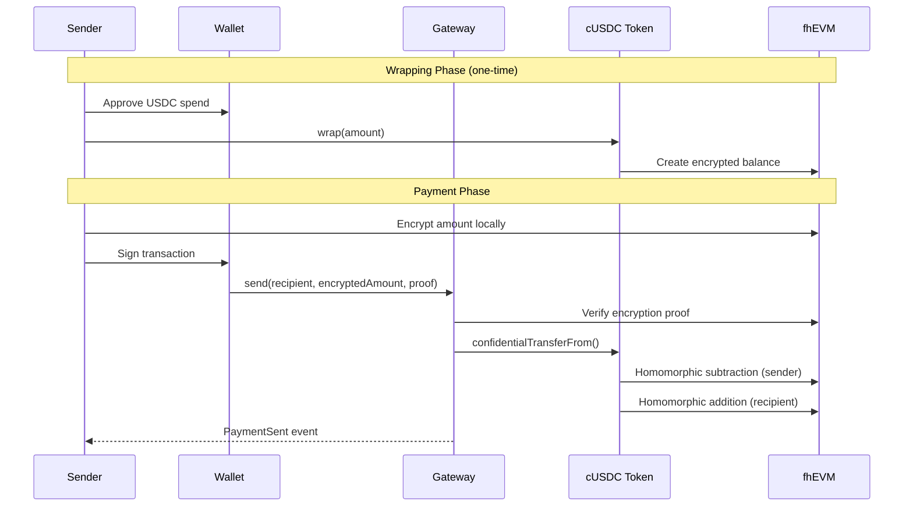

<p align="center">
  
</p>

<h1 align="center">Aruvi</h1>

<p align="center">
  <strong>Privacy-First Payments on Ethereum</strong><br>
  <em>அருவி (Aruvi) — Tamil for "waterfall" — where privacy flows freely</em>
</p>

<p align="center">
  <a href="#features">Features</a> •
  <a href="#architecture">Architecture</a> •
  <a href="#smart-contracts">Smart Contracts</a> •
  <a href="#getting-started">Getting Started</a> •
  <a href="#test-results">Test Results</a>
</p>

---

## Overview

Aruvi is a privacy-first payment protocol built on [Zama's fhEVM](https://www.zama.ai/fhevm) (Fully Homomorphic Encryption Virtual Machine). It enables confidential USDC transfers where **transaction amounts are encrypted on-chain** — only the sender and recipient can decrypt them.

Unlike traditional blockchain payments where anyone can view your transaction history, Aruvi ensures your financial data stays private while maintaining the security guarantees of Ethereum.

### Why Aruvi?

| Traditional Payments | Blockchain Payments | Aruvi |
|---------------------|---------------------|-------|
| ✅ Amount private | ❌ Amount public | ✅ Amount encrypted |
| ❌ Centralized | ✅ Decentralized | ✅ Decentralized |
| ❌ Slow settlement | ✅ Fast settlement | ✅ Fast settlement |
| ❌ High fees | ⚠️ Variable fees | ⚠️ Variable fees |
| ❌ Censorship risk | ✅ Censorship resistant | ✅ Censorship resistant |

---

## Features

### 🔐 Privacy-First Architecture
- Transaction amounts encrypted using Fully Homomorphic Encryption (FHE)
- Only sender and recipient can decrypt payment details
- On-chain computation on encrypted data without decryption

### 💸 Core Payment Features
- **Send** — P2P encrypted payments
- **Request** — Request money with shareable links/QR codes  
- **Multi-Send** — Batch payments to up to 10 recipients
- **Subscriptions** — Recurring payments with encrypted amounts
- **Refunds** — Recipients can refund payments

### 🪙 USDC Integration
- Wraps Circle's official USDC into confidential cUSDC
- 1:1 conversion rate (1 USDC = 1 cUSDC)
- Unwrap back to standard USDC anytime

### 🛠️ Developer SDK
- JavaScript/TypeScript SDK for business integration
- React components for checkout flows
- Server-side payment verification utilities

---

## Architecture

### High-Level Overview

```mermaid
graph TB
    subgraph "User Layer"
        U1[👤 Sender]
        U2[👤 Recipient]
        W[🦊 Wallet]
    end
    
    subgraph "Frontend"
        APP[⚛️ React App]
        SDK[@aruvi/sdk]
    end
    
    subgraph "Smart Contracts"
        GW[AruviPaymentGateway]
        WR[ConfidentialUSDCWrapper]
    end
    
    subgraph "External"
        USDC[💵 Circle USDC]
        FHE[🔐 Zama fhEVM]
    end
    
    U1 --> W --> APP
    U2 --> W --> APP
    APP --> SDK --> GW
    GW --> WR
    WR --> USDC
    GW --> FHE
    WR --> FHE
```

### Payment Flow



### Contract Architecture

```mermaid
graph LR
    subgraph "Aruvi Protocol"
        GW[AruviPaymentGateway<br/>━━━━━━━━━━━━━<br/>• send()<br/>• multiSend()<br/>• createRequest()<br/>• fulfillRequest()<br/>• createSubscription()<br/>• executeSubscription()<br/>• refund()]
        
        WR[ConfidentialUSDCWrapper<br/>━━━━━━━━━━━━━<br/>• wrap()<br/>• unwrap()<br/>• confidentialTransfer()<br/>• confidentialBalanceOf()]
    end
    
    subgraph "External Dependencies"
        USDC[Circle USDC<br/>ERC-20]
        OZ[OpenZeppelin<br/>ERC7984]
        ZAMA[Zama<br/>fhEVM]
    end
    
    GW -->|uses| WR
    WR -->|wraps| USDC
    WR -->|extends| OZ
    WR -->|encryption| ZAMA
    GW -->|encryption| ZAMA
```

### Data Flow

```mermaid
flowchart LR
    subgraph "Public Data"
        A1[Sender Address]
        A2[Recipient Address]
        A3[Timestamp]
        A4[Payment ID]
    end
    
    subgraph "Encrypted Data"
        E1[🔒 Amount]
        E2[🔒 Balance]
        E3[🔒 Totals]
    end
    
    subgraph "Access Control"
        AC1[Sender can decrypt]
        AC2[Recipient can decrypt]
        AC3[Contract can compute]
    end
    
    E1 --> AC1
    E1 --> AC2
    E2 --> AC1
    E3 --> AC1
```



---

## Smart Contracts

### ConfidentialUSDCWrapper

Wraps standard ERC-20 USDC into confidential ERC-7984 tokens.

| Function | Description |
|----------|-------------|
| `wrap(to, amount)` | Convert USDC → cUSDC |
| `unwrap(from, to, amount)` | Convert cUSDC → USDC |
| `confidentialTransfer(to, encAmount, proof)` | Transfer encrypted tokens |
| `confidentialBalanceOf(account)` | Get encrypted balance handle |
| `setOperator(operator, until)` | Authorize spending |

### AruviPaymentGateway

Main payment processor handling all P2P transactions.

| Function | Description |
|----------|-------------|
| `send(recipient, encAmount, proof)` | Send encrypted payment |
| `multiSend(recipients[], amounts[], proofs[])` | Batch send (max 10) |
| `createRequest(encAmount, proof, expiry)` | Create payment request |
| `fulfillRequest(requestId, encAmount, proof)` | Pay a request |
| `cancelRequest(requestId)` | Cancel your request |
| `createSubscription(recipient, encAmount, proof, interval)` | Setup recurring payment |
| `executeSubscription(subscriptionId)` | Execute due payment |
| `cancelSubscription(subscriptionId)` | Stop subscription |
| `refund(paymentId)` | Refund payment (recipient only) |

### Events

```solidity
event PaymentSent(bytes32 indexed paymentId, address indexed from, address indexed to);
event PaymentRefunded(bytes32 indexed paymentId);
event RequestCreated(bytes32 indexed requestId, address indexed requester);
event RequestFulfilled(bytes32 indexed requestId, bytes32 indexed paymentId);
event RequestCancelled(bytes32 indexed requestId);
event SubscriptionCreated(bytes32 indexed subscriptionId, address indexed subscriber, address indexed recipient);
event SubscriptionPaid(bytes32 indexed subscriptionId, bytes32 indexed paymentId);
event SubscriptionCancelled(bytes32 indexed subscriptionId);
```

---

## Getting Started

### Prerequisites

- Node.js 18+
- Git
- MetaMask or compatible wallet
- Sepolia ETH (for gas)
- Sepolia USDC (for testing)

### Installation

```bash
# Clone repository
git clone https://github.com/yourusername/aruvi.git
cd aruvi

# Install contract dependencies
cd contracts
npm install

# Install frontend dependencies
cd ../frontend
npm install

# Install SDK dependencies
cd ../sdk
npm install
```

### Development

```bash
# Compile contracts
cd contracts
npx hardhat compile

# Run tests
npx hardhat test

# Start frontend
cd ../frontend
npm run dev
```

### Deployment

```bash
# Deploy to Sepolia
cd contracts
cp .env.example .env
# Edit .env with your keys
npx hardhat deploy --network sepolia
```

---

## Test Results

```
  Aruvi Protocol
    ConfidentialUSDCWrapper
      Deployment
        ✔ should have correct name
        ✔ should have correct symbol
        ✔ should have correct underlying token
        ✔ should have 6 decimals matching USDC
        ✔ should have 1:1 conversion rate
      Wrapping USDC → cUSDC
        ✔ should wrap USDC into cUSDC
        ✔ should create encrypted balance after wrap
        ✔ should decrypt to correct wrapped amount (92ms)
        ✔ should allow wrapping to different recipient (76ms)
        ✔ should revert on insufficient allowance
      Confidential Transfers
        ✔ should transfer encrypted tokens between users (158ms)
    AruviPaymentGateway
      Deployment
        ✔ should set correct owner
        ✔ should set correct default token
      Send Payment
        ✔ should send encrypted payment (48ms)
        ✔ should update payment count
        ✔ should revert when sending to self
        ✔ should revert when sending to zero address
      Multi-Send
        ✔ should send to multiple recipients (110ms)
        ✔ should revert with more than 10 recipients (147ms)
      Payment Requests
        ✔ should create payment request
        ✔ should fulfill payment request (58ms)
        ✔ should cancel payment request
      Subscriptions
        ✔ should create subscription
        ✔ should execute subscription payment (40ms)
        ✔ should cancel subscription
        ✔ should revert subscription with interval less than 1 day
      Refunds
        ✔ should allow recipient to refund
        ✔ should mark payment as refunded
        ✔ should revert double refund
        ✔ should revert refund by non-recipient
      View Functions
        ✔ should return payment info (41ms)
        ✔ should return subscription info
      Admin Functions
        ✔ should allow owner to change default token
        ✔ should revert non-owner token change
        ✔ should transfer ownership
        ✔ should revert ownership transfer to zero address

  36 passing (4s)
```

---

## Project Structure

```
aruvi/
├── contracts/              # Solidity smart contracts
│   ├── contracts/
│   │   ├── AruviPaymentGateway.sol
│   │   ├── ConfidentialUSDCWrapper.sol
│   │   └── test/MockUSDC.sol
│   ├── test/
│   │   └── Aruvi.test.ts
│   └── hardhat.config.ts
│
├── frontend/               # React web application
│   ├── src/
│   │   ├── components/
│   │   ├── hooks/
│   │   ├── pages/
│   │   └── providers/
│   └── vite.config.ts
│
├── sdk/                    # JavaScript SDK
│   ├── src/
│   │   ├── index.ts
│   │   ├── constants.ts
│   │   ├── verify.ts
│   │   └── react.tsx
│   └── package.json
│
└── docs/                   # Documentation site
    ├── docs/
    └── docusaurus.config.ts
```

---

## Security Considerations

### FHE Security Model

- Encryption keys managed by Zama's coprocessor
- Computations performed on ciphertext (no decryption during processing)
- Only authorized parties can request decryption

### Contract Security

- Overflow protection on encrypted totals
- Silent failure handling for confidential transfers
- Owner-only admin functions
- Refund restricted to payment recipient

### Audits

- [ ] Pending third-party audit

---

## Testnet Deployment

| Contract | Address | Network |
|----------|---------|---------|
| AruviPaymentGateway | `0x...` | Sepolia |
| ConfidentialUSDCWrapper | `0x...` | Sepolia |
| USDC (Circle) | `0x1c7D4B196Cb0C7B01d743Fbc6116a902379C7238` | Sepolia |

---

## Tech Stack

| Layer | Technology |
|-------|------------|
| Smart Contracts | Solidity 0.8.27, Hardhat |
| FHE | Zama fhEVM, OpenZeppelin ERC-7984 |
| Frontend | React 18, TypeScript, Vite |
| Wallet | wagmi v2, viem, RainbowKit |
| Styling | Tailwind CSS, Framer Motion |
| Docs | Docusaurus 3 |

---

## Contributing

Contributions welcome! Please read our contributing guidelines before submitting PRs.

1. Fork the repository
2. Create your feature branch (`git checkout -b feature/amazing-feature`)
3. Commit your changes (`git commit -m 'Add amazing feature'`)
4. Push to the branch (`git push origin feature/amazing-feature`)
5. Open a Pull Request

---

## License

MIT License — see [LICENSE](LICENSE) for details.

---

## Acknowledgments

- [Zama](https://www.zama.ai/) — fhEVM and FHE infrastructure
- [Circle](https://www.circle.com/) — USDC stablecoin
- [OpenZeppelin](https://www.openzeppelin.com/) — ERC-7984 confidential token standard

---

<p align="center">
  Built with 🔐 by the Aruvi Team
</p>
